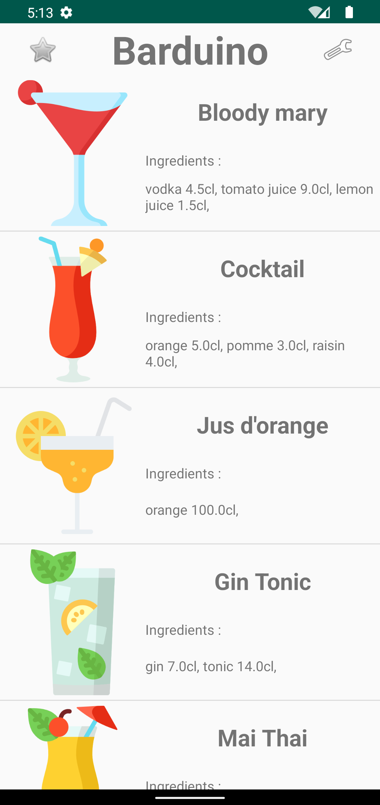
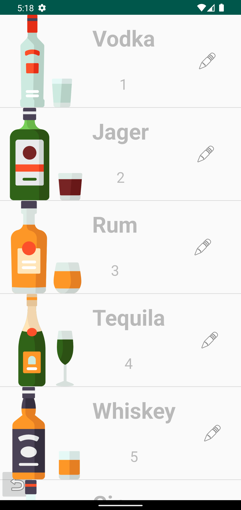
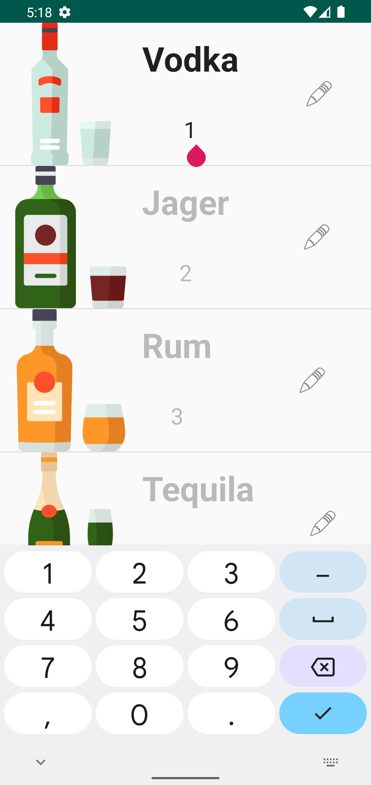

# Barduino-app

  A mobile application to control an automated cocktail machine based on arduino.
   
  <i>
    Warning: this repo is still under developpement and is not stable at all. Feel free to contribute if you want to help.
  </i>
   
  
   

The goal of this mobile app will be to allow users to remotely control an Arduino-powered automated bar over Bluetooth : [barduino project](https://github.com/hippiiee/barduino).
With the app, users can select from a variety of predefined drink recipes, customize their own drinks by adjusting the proportions of ingredients, and even create and save new recipes for future use. The app communicates with the Arduino microcontroller via Bluetooth, sending commands to dispense specific amounts of ingredients and stir the drinks as needed.

## Features

- [x] Select from a list of predefined drink recipes
- [x] Modify bottle content
- [x] Modify bottle position
- [ ] Adjust the proportions of ingredients in a recipe to suit your personal taste
- [ ] Save your favorite recipes for easy access in the future
- [ ] Connect to the Arduino via Bluetooth for seamless communication
- [ ] View a real-time status update of the automated bar, including the current drink being prepared and the progress of the mixing process

## Project architecture

To represent drinks and bottles in the mobile app, I chose to use Java objects. This means that each drink and bottle has its own set of data and behaviors that are defined using getters and setters. Using objects in this way allows us to structure and organize the data and functionality related to these entities in a clear and cohesive manner. It also makes it easier to work with drinks and bottles within the app, as we can manipulate them as self-contained units with their own set of properties and methods. Additionally, using objects helps to make the code more maintainable and easy to understand, as we can encapsulate the data and functionality of drinks and bottles within a single entity.

## Screenshots

### Homepage

### Bottle list

### Bottle edit
